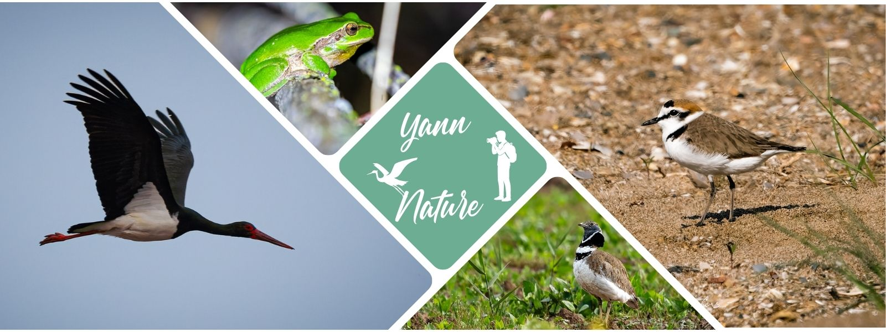

# 🌿 Yann GESHORS — Nature & Biodiversité
**Observer • Comprendre • Protéger**

---

## 👋 Qui je suis

Je m’appelle **Yann GESHORS**.  
Passionné de nature depuis toujours, je passe une grande partie de mon temps **sur le terrain** : observer, photographier, comprendre les espèces et les milieux — en particulier sur le **littoral méditerranéen**.

Ce site est mon espace personnel : un **carnet naturaliste**, une **galerie photo**, et un endroit pour partager des sorties, des notes de terrain et des projets.

---

## 🧭 Ce que tu trouveras ici

### 🗒️ Carnet de terrain
Des sorties, des observations, des comportements notables, des ambiances, et parfois des alertes (dérangements, pressions sur les milieux, etc.).  
➡️ **[Ouvrir le carnet](carnet.html)**

### 📸 Photographie nature
Des images prises sur le vif, sans mise en scène, pour raconter le vivant tel qu’il est.  
➡️ **[Voir les photos](photos.html)**

### 🚶 Sorties & notes
Des lieux, des dates, des conditions, des espèces observées — et ce que j’en retiens.  
➡️ **[Voir les sorties](sorties.html)**

---

## 🌊 Terrains de prédilection

- **Littoral & dunes** (fréquentation, dérangements, nidification)
- **Lagunes & zones humides** (amphibiens, avifaune, cycles saisonniers)
- **Milieux ouverts** (oiseaux de plaine, comportements, suivis)

Je m’intéresse autant aux espèces qu’aux **équilibres** : ce qui aide le vivant… et ce qui le fragilise.

---

## 🌱 Ma manière d’être sur le terrain

- observation discrète, respect des distances
- approche naturaliste + photo comme outil de mémoire
- intérêt pour les espèces “ordinaires” autant que les espèces emblématiques
- envie de transmettre : rendre la nature **lisible** et **aimable**, sans la simplifier

---

## 🔗 Accès rapides

- 🗒️ **[Carnet de terrain](carnet.html)**
- 📸 **[Photos](photos.html)**
- 🚶 **[Sorties](sorties.html)**
- 🌱 **[Projets](projets.html)**
- 📬 **[Contact](contact.html)**

---

## 📬 Me contacter

Une question, une observation à partager, un projet, une collaboration ?  
➡️ **[Contact](contact.html)**
